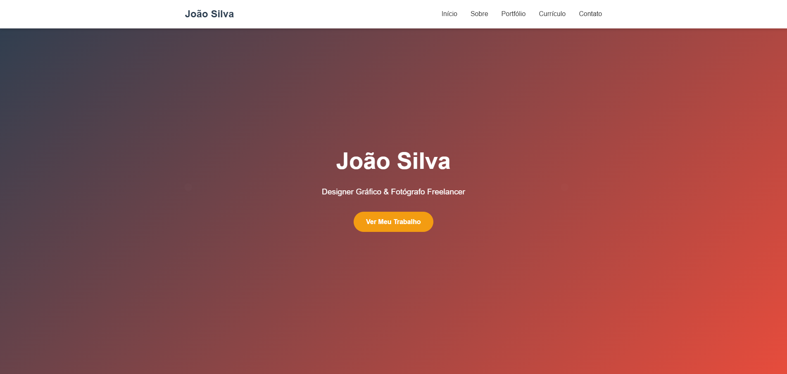

# 💼 PortfolioPro – Portfólio Profissional de Desenvolvedor Front-end

O **PortfolioPro** é um portfólio pessoal desenvolvido com foco em performance, design moderno e responsividade. Ele apresenta os principais projetos, habilidades e informações de contato de forma clara e profissional, ideal para destacar sua atuação como desenvolvedor front-end.

## 🚀 Demonstração

🔗 [Acesse a versão online](https://jhonatanolivv.github.io/PortfolioPro/)

## 🛠️ Tecnologias Utilizadas

- HTML5  
- CSS3  
- JavaScript

## 🎯 Funcionalidades

- Design responsivo para todos os dispositivos  
- Seção de apresentação com imagem e descrição pessoal  
- Lista de projetos com links e descrições  
- Botões de navegação suave (scroll)  
- Seção de contato

## 📁 Estrutura do Projeto

- `index.html` – Estrutura principal do portfólio  
- `style.css` – Estilização personalizada do site  
- `script.js` – Funcionalidades de interação

## 📸 Captura de Tela

